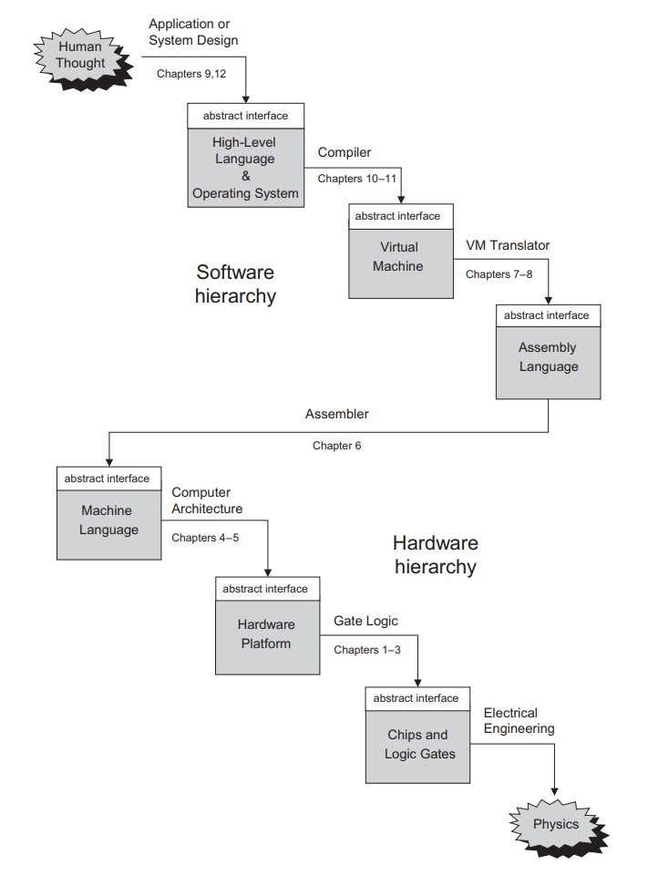

# Nand-To-Games
  Start Date : 20-04-2020
  
  Expected completion : 3 weeks
  
  Completed in : 4 weeks
  
  Project : https://www.nand2tetris.org/
  
  NOTE: Checkout [this link](https://github.com/sid597/Nand-To-Games/tree/9f95600f7bb752688015713ce4e908fdfeda96bb) to my intial commit and see what boilerplate code and tests were provided by the course staff

 ## About the Project
The idea is to understand how computer's work and whats a better way than to build one. In this course I am building a modern computer from just a Nand gate. The hardware is built using HDL
software provided by the system architect, following projects are build in this course:

* Project 1: Boolean Logic
* Project 2: Boolean Arithmetic
* Project 3: Sequential Logic
* Project 4: Machine Language
* Project 5: Computer Architecture
* Project 6: Assembler
* Project 7: VM I: Stack Arithmetic
* Project 8: VM II: Program Control
* Project 9: High-Level Language
* Project 10: Compiler I: Syntax Analysis
* Project 11: Compiler II: Code Generation
* Project 12: Operating System

NOTE: For what is done in each week go to that particular week you will find a readme for that project. 

## Why doing this course ?

1. For the thrill of making something from nothing.

2. Because I don't know how computers work ( I know in bits and pieces but not completely) and I think it is really important for anyone in this field to understand how computers work. 

3. Other specific courses in compiler, OS, computer architecture would be an overkill at the this point for me. Once I complete this course I will decide in which topic I would like to dig deeper this way I will have the bigger picture clear in my mind while I learn the nitty gritties of xyz.

4. I want to make some more projects like building (not full fledged production grade but covering the most crucial aspects of :) an HTTP server, docker, frontend framework, Database, Web server, command line tools. And whenever I try to build anything like this I face the issue of not knowing how os, compilers etc work so I want to take this course and build upon it.

5. I want to Build something instead of just consuming content ( like reading tutorials, books, video lectures etc.)

6. "What I cannot create I do not understand"     --Richard Feynman

